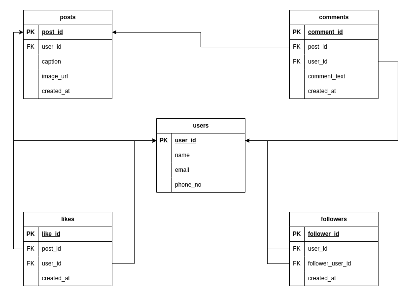

# Instagram Data Modeling with PostgreSQL
The goal of this project is to create a comprehensive data model for Instagram, capturing the essential entities and their relationships. By utilizing PostgreSQL, we can design an efficient and scalable database structure to support the functionality of Instagram.

## Data Model Design
The data model is designed to represent the main entities in Instagram, including users, posts, comments, likes, and followers. Each entity has its attributes, and relationships are established through primary key and foreign key constraints. The data model ensures data integrity and enables effective querying and retrieval of Instagram-related information.

## Table Creation Statements
The following are the SQL statements for creating the tables in the Instagram data model:

- `users`: Represents Instagram users with attributes such as `user_id`, `name`, `email`, and `phone_number`.
- `posts`: Stores Instagram posts with attributes like `post_id`, `user_id`, `caption`, and `created_at`.
- `comments`: Manages comments on Instagram posts, storing information such as `comment_id`, `post_id`, `user_id`, `comment_text`, and `created_at`.
- `likes`: Tracks likes given to Instagram posts, recording details like `like_id`, `post_id`, `user_id`, and `created_at`.
- `followers`: Handles the follower relationships between Instagram users, capturing `follower_id`, `user_id`, `follower_user_id`, and `created_at`.

Please refer to the accompanying SQL script for the complete table creation statements.

## Getting Started
Follow the steps below to get started with the project:

1. Clone the repository to your local machine.

2. Connect to your PostgreSQL database using your preferred tool or command line.

3. Execute the Python script provided to create the database and the required tables.

---

Feel free to explore this project further and leverage the data model to build Instagram-related applications or enhance your understanding of database design principles.
